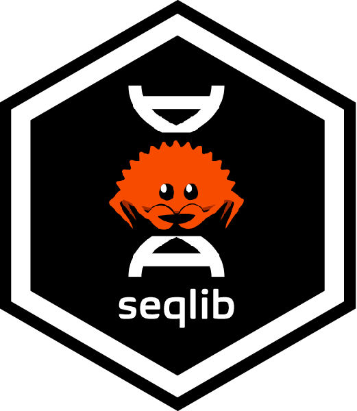
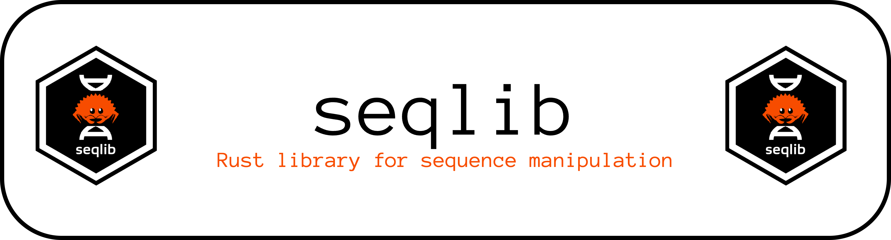

<!-- # seqlib  -->



`seqlib` is a Rust library for working with DNA and RNA sequences.

It provides a **robust core representation** for biological sequences with:
- Explicit DNA / RNA alphabets
- Dedicated types for sequences with and without IUPAC ambiguity support

`seqlib` is designed as a **library dependency**, not a command-line tool.  
It is developed to support the `scarscape` project, but is usable on its own for
any Rust code that needs reliable nucleotide sequence handling.

---

## Design goals

- **Correctness first**: invalid sequences are rejected at construction
- **Type safety**: DNA and RNA sequences are distinct types, not runtime flags
- **Strict alphabets**: DNA and RNA reject invalid bases at construction  (e.g. `U` in DNA, `T` in RNA)
- **Explicit ambiguity handling**: ambiguous IUPAC bases (S/W/N) are modeled with their own types (e.g. `IupacDnaBase` vs `DnaBase`).
- **Ergonomic by default**: core sequence operations use copy-on-modify semantics, making them easy to compose and safe for downstream use.
- **Explicit performance opt-ins**: in-place modifying methods are provided to maximise performance or minimise memory-footprint
- **Small surface area**: no I/O, no parsing frameworks, no CLI
- **Composable**: intended to be embedded in larger bioinformatics pipelines

---

## Adding to your project

Add `seqlib` library to your project:

```bash
cargo add seqlib --git https://github.com/selkamand/seqlib
```

---

## Core types

Most users should work with the sequence types:

- `DnaSeq` — DNA sequences with concrete base types (`A, C, G, T`)
- `RnaSeq` — RNA sequences with concrete base types (`A, C, G, U`)
- `IupacDnaSeq` — DNA sequences with degenerate base types (`A, C, G, T` + IUPAC ambiguity codes)
- `IupacRnaSeq` — RNA sequences with degenerate base types (`A, C, G, U` + IUPAC ambiguity codes)

These are type aliases over a generic `Seq<B>` implementation and are the
**recommended entry points** for sequence creation and manipulation.

The generic `Seq<B>` type exists to support reusable algorithms and future
extensions, but most downstream code should not need to interact with it
directly.

Note that because `Degenerate` sequence types (`IupacDnaSeq`) can have ambiguous bases (like `N`) 
not all methods will be the same as their `Concrete` sequence equivalents (`DnaSeq`). 
For example, Iupac sequences have a `is_palindromic_checked()` method that returns a `Result<bool>` with an error 
when ambiguous bases are present as they prevent us from confidently assessing palindrome status either way. 
In contrast `DnaSeq` has an `is_palindromic` function that always returns `true/false` due to lack of ambiguous bases. 

---

## Basic usage

```rust
use seqlib::sequences::DnaSeq;

fn main() -> Result<(), Box<dyn std::error::Error>> {
    let seq = DnaSeq::new("ACGT")?;

    println!("Sequence: {}", seq);
    println!("Length: {}", seq.len());
    println!("Reverse complement: {}", seq.reverse_complement());

    Ok(())
}
```

Invalid input is rejected immediately:

```rust
let bad = DnaSeq::new("ACGTX"); // returns Err(...)
```

---

## Copy-on-modify vs in-place mutation

`seqlib` is designed to be **ergonomic by default**.

All standard sequence operations such as reverse complementation, subsequence
extraction, and reversal use **copy-on-modify semantics** by default. These methods return
new sequences rather than mutating existing ones, making them easy to compose,
store, and pass through downstream code without surprising side effects.

For performance-critical or memory-sensitive workflows, `seqlib` also exposes
explicit **in-place mutation** methods (e.g. `reverse_complement_in_place`). 
These methods are clearly named and opt-in, allowing callers
to trade ergonomics for efficiency when appropriate.

---

## Coordinate System

Seqlib considers supports two different ways to number biological sequences: *Interbase* and *Base*

### In-base coordinates (1-based)

Each base is numbered starting at 1

```
A T A C G
1 2 3 4 5
```

So a `BasePos` of `4` refers to a `C` 
and an `BaseInterval` of 2-4 refers to the 3bp sequence `TAC` (both-end inclusive)

The main limitations of in-base coordinate systems is that insertions happen between residues while deletions and substitutions happen to residues.
So if using In-base coordinates the position of an insertion must be considered **exclusive** while the position of a deletion/substitution are considered **inclusive**
The Variant Representation Specification (VRS) [manuscript](https://pmc.ncbi.nlm.nih.gov/articles/PMC8929418/) does a great job of explaining this.


### Interbase coordinates (0-based)

Numbers are assigned to the space between bases (starting at 0).

```
  A   T   A   C   G
0   1   2   3   4   5
    |-----------|
```

So an `InterbasePos` of `4` doesn't mean much by itself, 
but packaged into an `InterbaseInterval` (e.g. `1-4`) unambiguously describe the sequence (`TAC`).

Interbase coordinate systems are also great for unambiguosly describing mutated sequences (including insertions, which happen between bases). 
This is why (inspired by the GA4GH Variant Representation Specification) `seqlib` mutation data types use interbase coordinates.


### Important Notes

seqlib does NOT treat these coord systems interchangeably nor offers generic position / interval traits. 
Every function MUST specifically decide which position or interval type it expects and returns. 
This is an intentional design decision.

---

## Ambiguity handling

`seqlib` supports IUPAC ambiguity codes (e.g. `N`, `R`, `Y`, `S`), but **does not
treat ambiguous symbols as wildcards** in higher-level analyses.

Ambiguous bases represent *unknown concrete bases*, not flexible matches. As a
result, operations that require certainty (such as palindromic sequence
detection) will conservatively return `false` if ambiguity is present.

---

## Palindromic sequences

`seqlib` defines palindromic sequences using a **strict, certainty-based
definition**.

A sequence is considered palindromic only if:
- its length is **non-zero and even**, and
- it is identical to its **reverse complement** at the level of concrete bases.

We can only identify palindromes for sequences with **no ambiguous bases**. For example, `NNNNNNN` is *symbolically* palindromic but in reality the sequence is ambiguous and palindrome status is indeterminate. In these cases it will return an error

```rust
use seqlib::sequences::DnaSeq;

assert!(DnaSeq::new("GAATTC").unwrap().is_palindromic());
assert!(!DnaSeq::new("NNNNNN").unwrap().is_palindromic());
assert!(!DnaSeq::new("AAA").unwrap().is_palindromic());
```

This conservative definition is intentional and designed for statistical and
motif-based analyses where false positives must be avoided.

---

## Examples

See the [`examples/`](examples) directory for typical usage patterns and
small self-contained demonstrations.

---

## Out of Scope

To keep seqlib focused the following features will not be implemented in this
library.

- No FASTA / FASTQ parsing
- No file I/O
- No CLI
- No alignment, variant calling, or translation logic
- No soft-masking or case preservation
- No protein sequence support

`seqlib` is intended to be a **foundation**, not a full bioinformatics toolkit.

---

## Errors

The goal of this library is to always return an explicit and informative Error enum when users attempt to do something unsupported or invalid.
If any function in the seqlib library panics, this indicates a bug within the library itself! Please report it as an issue in this repository.
